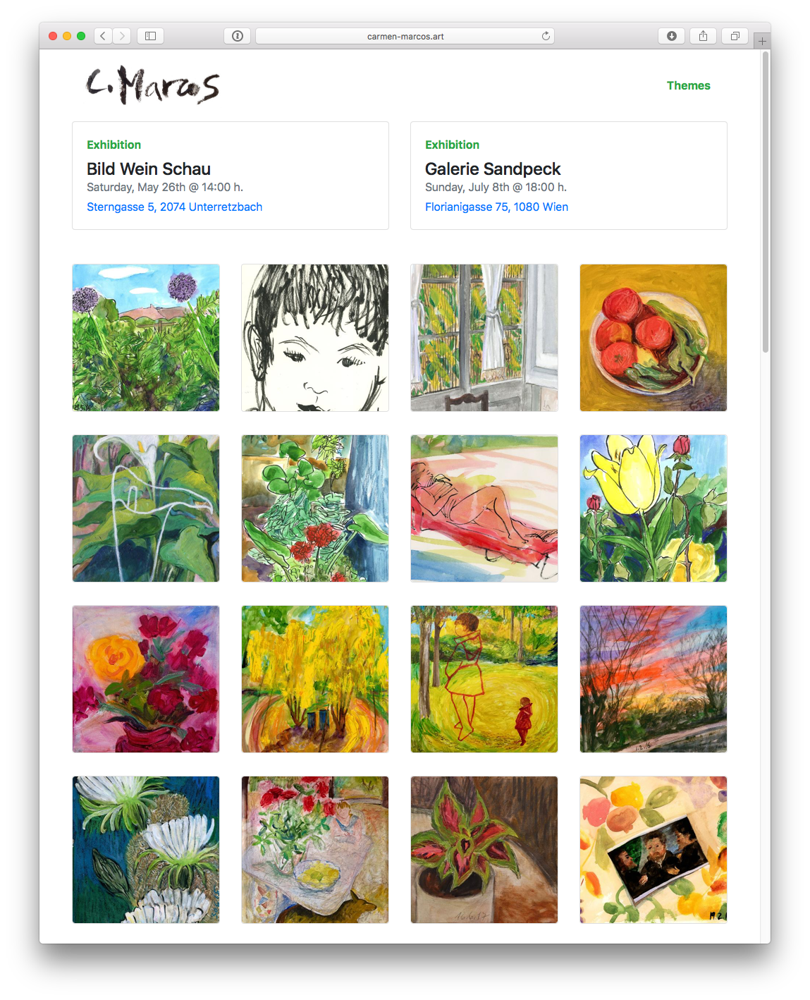

# Carmen Marcos Art

This site was built with React Static [basic example](examples/basic) using content managed with [Gentics Mesh](https://getmesh.io/).



## How to run the example
To get started, clone this repo and run these commands in your terminal:

```
yarn
yarn start
```

To suggest changes, submit a PR!

## Gentics Mesh
Please, note that the data displayed by this app comes from my own Gentics Mesh instance.
To get your [Gentics Mesh](https://getmesh.io/) instance up and running. You can use 
- docker
``` 
docker run -p 8080:8080 gentics/mesh-demo
``` 
For more details check the [Mesh Administration Guide](https://getmesh.io/docs/beta/administration-guide.html).

Check the configuration in [static.config.js](static.config.js) and the schemas you will need to configure in Mesh in [doc/schemas](doc/schemas).